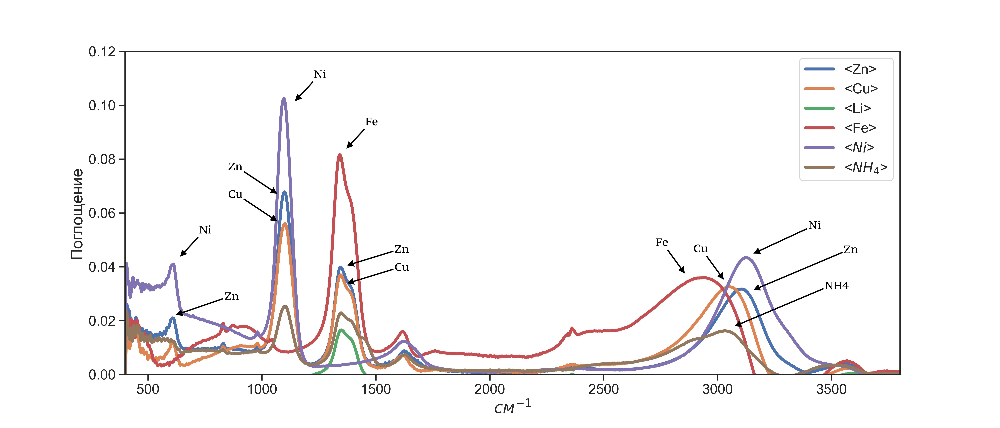
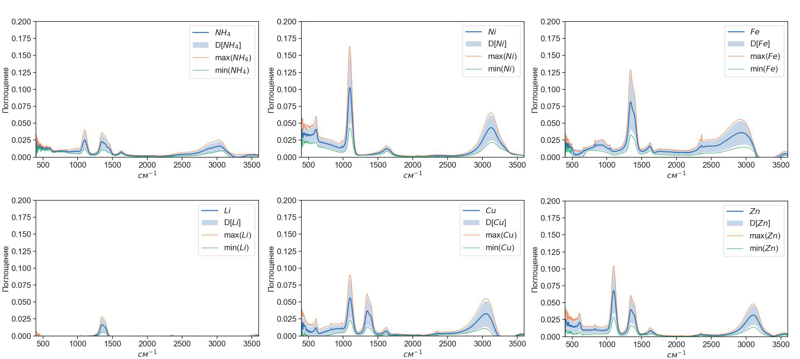
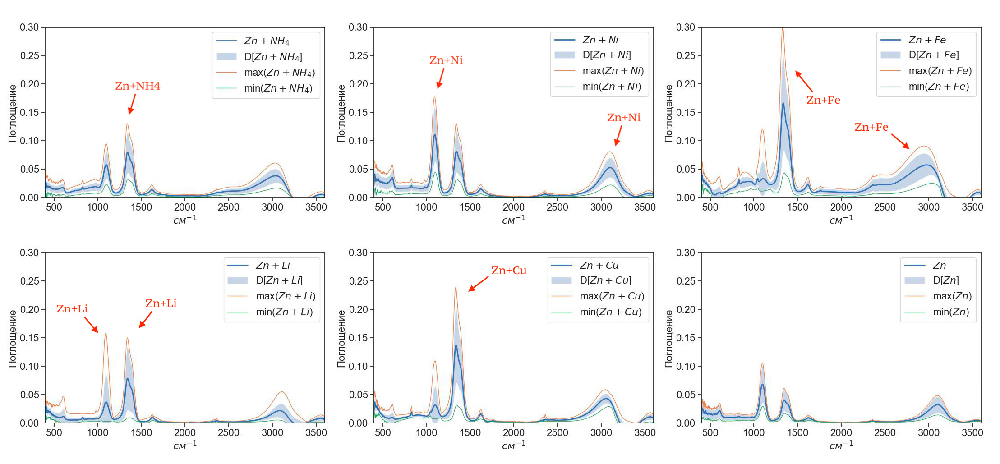

# Спектры солей тяжелый металлов

Данный репозиторий содержит базу данных с ИК спектрами и спектрами оптического поглощения солей тяжелых мателлов. Исходные данные можно найти на [сервере](http://213.131.1.132:25621/owncloud/index.php/apps/files/?dir=/HM_Salts_water_2022&fileid=281971). 
В качестве образцов реальной речной воды выступали образцы из московских рек Яузы, Битцы, Сетуни («серебряные» серии по 200 образцов) и реки Москва («золотая» серия из 400 образцов, проба отобрана в районе Островной улицы на западе Москвы). 

# 0. О базе данных.
В июле-августе 2022 года была получена база данных спектров ИК-поглощения (ИК), оптического поглощения (ОП) и комбинационного рассеяния (КР) света растворами неорганических солей $Zn(NO_3)_2$, $ZnSO_4$, $Cu(NO_3)_2$, $СuSO_4$, $LiNO_3$, $Fe(NO_3)_3$, $NiSO_4$, $Ni(NO_3)_2$, $(NH_4)_2SO_4$, $NH_4(NO_3)$ в различных водах. Дополнительно измерялся pH растворов.

Полученные спектры можно разделить на следующие серии:
- Базовая серия (Содержит 3744 уникальных примера с ненулевой концентрацией солей в дистиллированной воде)
- Золотая серия (Содержит 400 образцов, проба отобрана в районе Островной улицы на западе Москвы)
- Серебряная серия (3 серии по 200 образцов из московских рек Яузы, Битцы, Сетуни)

# 1. Базовая серия.

## 1.1. Описание файлов концентраций (правильные ответы). 
В репозитории 2 файла концентраций. 
 1. В файле [salts_water_basic_output_s.csv](./data/raw/salts_water_basic_output_s.csv) записаны концентрации солей, единицы измерения концентраций - М.
 Первый столбец - номер примера, следующие столбцы - концентрации солей (10 столбцов).
 
 Отметим, что у солей сильно отличается представительность! Это связано с причинами, изложенными в п.'Принципы формирования файлов с концентрациями' (если кратко, то с попыткой отвязать катионы от анионов и с растворимостью отдельных солей).
 
 Количество примеров с ненулевыми концентрациями солей:
 - $Zn(NO_3)_2$: 2349
 - $ZnSO_4$: 28
 - $Cu(NO_3)_2$: 2354
 - $СuSO_4$: 23
 - $LiNO_3$: 2373
 - $Fe(NO_3)_3$: 2373
 - $NiSO_4$: 2365
 - $Ni(NO_3)_2$: 8
 - $(NH_4)_2SO_4$: 2365
 - $NH_4(NO_3)$: 12
 
 2. В файле [salts_water_basic_output_i.csv](./data/raw/salts_water_basic_output_i.csv) записаны пересчитанные концентрации ионов, единицы измерения концентраций - М. Первый столбец - номер примера, следующие столбцы - концентрации ионов (8 столбцов): 6 ионов тяжелый металов ( $Zn$, $Cu$, $Li$, $Fe$, $Ni$, $NH_4$) и 2 аниона ( $SO_4$, $NO_3$).
 
  Количество примеров с ненулевыми концентрациями ионов:
 - Zn: 2373
 - Cu: 2373
 - Li: 2373
 - Fe: 2373
 - Ni: 2373
 - NH_4: 2373
 - SO_4: 3361
 - NO_3: 3740

### ВНИМАНИЕ!!! 
Пример с номером '0' соответствует дистилляту.

- Данный пример отсутствует в случае спектроскопии оптического поглощения, поскольку спектр ОП раствора записывается относительно дистиллята.
- В случае ИК данному номеру соответсвуют [16 спектров дистилированный воды](./data/raw/salts_water_basic_IR_baseline.csv).

### Принципы формирования файлов с концентрациями

Изначально формировалась сетка с концентрациями ионов, причем условия ее формирования, сформулированные далее, применялись к катионам. Расчет концентраций анионов носил вторичный характер.

- Концентрация каждого катона изменяется в диапазон от 0 М до 1 М.
- Суммарная концентрация катионов в растворе не должна превышать 2 М - иначе содержимое раствора выпадет в осадок. (См. таблицу растворимости)
- Однокомпонентне растворы (содержащие 1 катион) по возможности должны формироваться с использованием как нитрата, так и сульфата, дабы провести "отвязку" катионов от анионов. Концентрация сульфатов и нитратов при этом была одинаковая. Это условие было выполнено для ионов (Zn, Cu, Ni, NH_4).
- Двухкомпонентные и трехкомпонентные растворы (содержащие 2 и 3 катиона): 

## 1.2. Оптическое поглощение (ОП) [salts_water_basic_OA.csv](./data/raw/salts_water_basic_OA.csv)
Примеров: 3744

Колличество признаков: 910

Диапазон регистрации спектров ОП: 190 - 1100 нм, шаг 1 нм.

В базе содержится по 4 спектра однокомпонентных (содержащих 1 катион) растворов. На графике представлены поканальные статистические показатели 'массива' спектров однокомпонентных растворов. 

Рис.1. Поканальные статистические показатели 'однокомпонентных' массивов данных.

- Полоса 600 - 1000 нм соответствует диапазону оптического поглощения меди.
- Полосы 350-450 нм и 600-800 нм - диапазону оптического поглощения никеля.
- Полоса 200-400 нм - диапазону оптического поглощения железа.
- Zn
- Li - 250 nm
- NH_4
- SO_4
- NO_3

Рис.2. Поканальные статистические показатели массива спектров ОП из базовой серии.

## 1.3. ИК-поглощение  [salts_water_basic_IR.csv](./data/raw/salts_water_basic_IR.csv)
База содержит - `3744` примера спектров. Колличество признаков - `2126`. Нулевая строка соответствует первой строке в файлах концентраций (т.е. не нулевой концентрации)

Примеров: 3744 + 16 спектров дистиллята

Колличество признаков: 2126

Диапазон регистрации спектров ИК: 4497.45 - 399.21 см^(-1).

В базе присутствует по 4 примера спектра однокомпонентных растворов. На графике ниже построены спектры, соответсвующие этим однокомпонентным растворам ионов, причем жирние линии - это поканальное среднее значение поглощения, полупрозрачные области - поканальная дисперсия. 

В таком представлении спектры визуаьно слабо различинмы. Ниже приведены те же самы спектры, только за вычетом поглощения воды. 

Тут отчетливо видно 4 характерные области пиков: ~ $1200 см^{-1}$, ~ $1400 см^{-1}$, ~ $1650 см^{-1}$ и ~ $3500 см^{-1}$. Раствор с ионом цинка имеет самый сильный пик в первой и четвертой областях, во второй и третей областях самым высоким поглощением обладает раствор с ионами железа. Раствор с ионами железа имеет характерную линию поглощения в диопазоне от ~ $1700 см^{-1}$ до ~ $3000 см^{-1}$

Ниже приведены те же самые спектры, только со статистическими показателями - дисперсией, средними, минимальным и максимальным значениями. Синий линей обозначено среднее значение спектра, желтой – максимальное значение поглощения, зеленой – минимальное, а синяя область отражает дисперсию спектра.

Так-же как и для спектор ОП, для спекторв ИК был построен график поканальных статистических показателей массивов спектра ИК поглощения для случая содержания двух катионов в растворе.  Катион Zn присутствует во всех наборах, изображенных на рисунке. Синий линей обозначено среднее значение спектра, желтой – максимальное значение поглощения, зеленой – минимальное, а синяя область отражает дисперсию спектра. 

