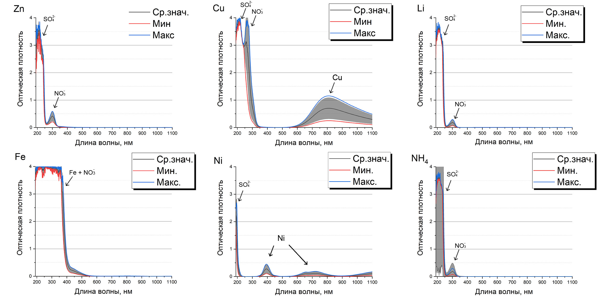
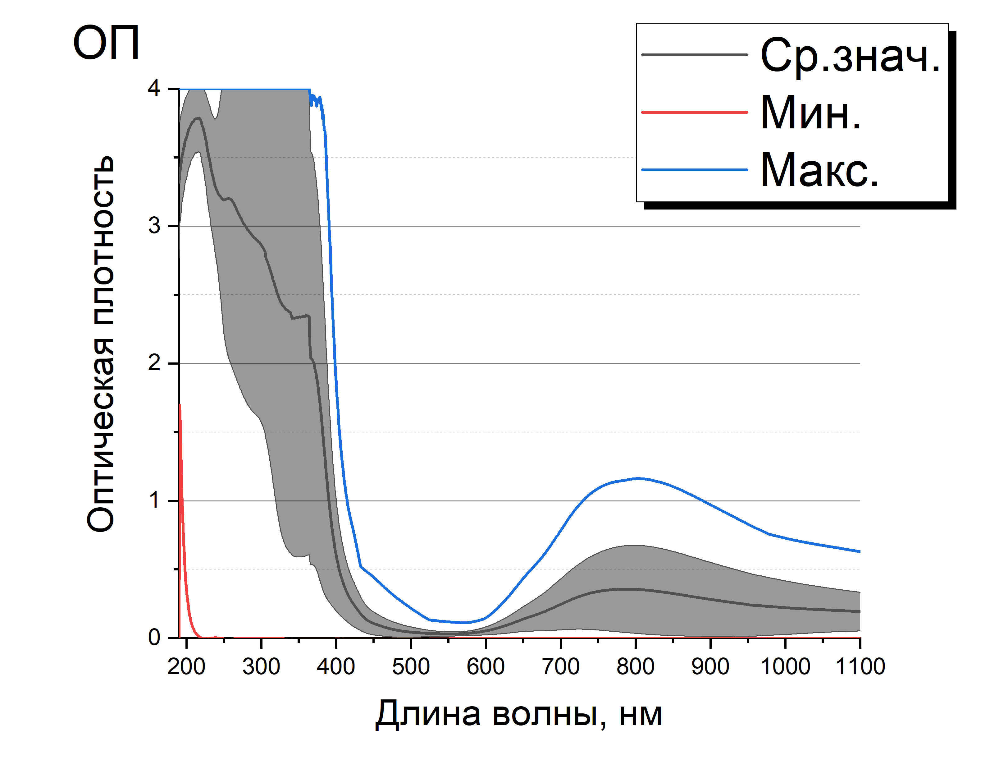
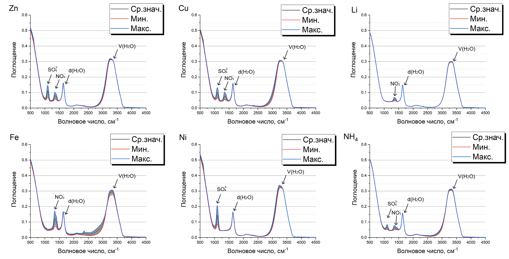
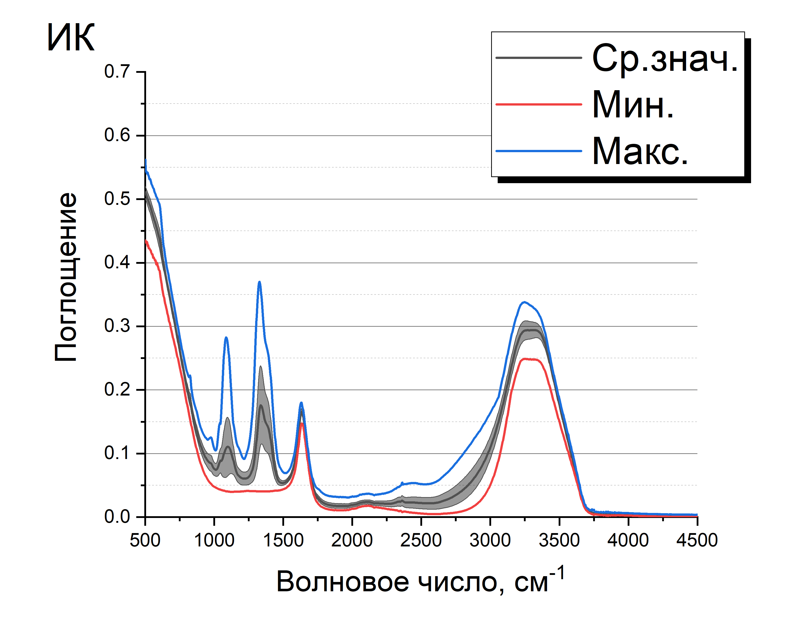

# Спектры солей тяжелый металлов

Данный репозиторий содержит базу данных с ИК спектрами и спектрами оптического поглощения солей тяжелых мателлов. Исходные данные можно найти на [сервере](http://213.131.1.132:25621/owncloud/index.php/apps/files/?dir=/HM_Salts_water_2022&fileid=281971). 
В качестве образцов реальной речной воды выступали образцы из московских рек Яузы, Битцы, Сетуни («серебряные» серии по 200 образцов) и реки Москва («золотая» серия из 400 образцов, проба отобрана в районе Островной улицы на западе Москвы). 

# 0. О базе данных.
В июле-августе 2022 года была получена база данных спектров ИК-поглощения (ИК), оптического поглощения (ОП) и комбинационного рассеяния (КР) света растворами неорганических солей $Zn(NO_3)_2$, $ZnSO_4$, $Cu(NO_3)_2$, $СuSO_4$, $LiNO_3$, $Fe(NO_3)_3$, $NiSO_4$, $Ni(NO_3)_2$, $(NH_4)_2SO_4$, $NH_4(NO_3)$ в различных водах. Дополнительно измерялся pH растворов.

Полученные спектры можно разделить на следующие серии:
- Базовая серия (Содержит 3744 уникальных примера с ненулевой концентрацией солей в дистиллированной воде)
- Золотая серия (Содержит 400 образцов, проба отобрана из Москва-реки в районе Островной улицы на западе Москвы)
- Серебряные серии (Включает 3 серии по 200 образцов из московских рек Яузы, Битцы, Сетуни)

# 1. Базовая серия.

## 1.1. Описание файлов концентраций (правильные ответы). 

Файлы с ответами расположены в директории 'outputs'. К базовой серии относятся 2 файла:

 а) В файле 'salts_water_basic_output_s.csv' записаны концентрации солей, единицы измерения концентраций - М.
 Первый столбец - номер примера, следующие столбцы - концентрации солей (10 столбцов).
 
 Отметим, что у солей сильно отличается представительность! Это связано с причинами, изложенными в п.'Принципы формирования файлов с концентрациями' (если кратко, то с попыткой отвязать катионы от анионов и с растворимостью отдельных солей).
 
 Количество примеров с ненулевыми концентрациями солей:
 - $Zn(NO_3)_2$: 2349
 - $ZnSO_4$: 28
 - $Cu(NO_3)_2$: 2354
 - $СuSO_4$: 23
 - $LiNO_3$: 2373
 - $Fe(NO_3)_3$: 2373
 - $NiSO_4$: 2365
 - $Ni(NO_3)_2$: 8
 - $(NH_4)_2SO_4$: 2365
 - $NH_4(NO_3)$: 12
 
 б) В файле 'salts_water_basic_output_i.csv' записаны пересчитанные концентрации ионов, единицы измерения концентраций - М. Первый столбец - номер примера, следующие столбцы - концентрации ионов (8 столбцов): 6 ионов тяжелый металов ( $Zn$, $Cu$, $Li$, $Fe$, $Ni$, $NH_4$) и 2 аниона ( $SO_4$, $NO_3$).

Диапазоны концентраций ионов

|  | Минимальное, М | Максимальное, М |
| --- | --- | --- |
| Zn | 0 | 1.089 |
| Cu | 0 | 0.955 |
| Li | 0 | 0.466 |
| Fe | 0 | 0.862 |
| Ni | 0 | 0.972 |
| NH4 | 0 | 0.801 |
| SO4 | 0 | 1.373 |
| NO3 | 0 | 4.906 |
 
  Количество примеров с ненулевыми концентрациями ионов:
 - Zn: 2373
 - Cu: 2373
 - Li: 2373
 - Fe: 2373
 - Ni: 2373
 - NH_4: 2373
 - SO_4: 3361
 - NO_3: 3740

### ВНИМАНИЕ!!! 
Пример с номером '0' соответствует дистилляту.

- Данный пример отсутствует в случае спектроскопии оптического поглощения, поскольку спектр ОП раствора записывается относительно дистиллята.
- В случае ИК и КР данному номеру соответсвуют 16 спектров дистилированный воды. Это файлы 'salts_water_basic_IR_dist.csv' и 'salts_water_basic_Raman_dist.xlsx' соответственно.

### Принципы формирования файлов с концентрациями - теоретические

Изначально формировалась сетка с концентрациями ионов, причем условия ее формирования, сформулированные далее, применялись к катионам. Расчет концентраций анионов носил вторичный характер.

- Концентрация каждого катона изменяется в диапазон от 0 М до 1 М.
- Суммарная концентрация катионов в растворе не должна превышать 2 М - иначе содержимое раствора выпадет в осадок. (См. таблицу растворимости)
- Однокомпонентне растворы (содержащие 1 катион) по возможности должны формироваться с использованием как нитрата, так и сульфата, дабы провести "отвязку" катионов от анионов. Концентрация сульфатов и нитратов при этом была одинаковая. Это условие было выполнено для ионов (Zn, Cu, Ni, NH_4).
- Двухкомпонентные и трехкомпонентные растворы (содержащие 2 и 3 катиона) должны формироваться с использованием как нитрата, так и сульфата, дабы провести "отвязку" катионов от анионов. В ходе экспериментов было выявлено, что 

## 1.2. Оптическое поглощение (ОП) 'salts_water_basic_OA.csv'

- Спектрофотометр Shimadzu UV1800. 
- Скорость сканирования «fast».
- Шаг 1 нм, щели 1 нм.
- Измерения проводились в тонкой кювете (длина оптического пути 1 мм) относительно дистиллята. 

Примеров: 3744

Колличество признаков: 910

Диапазон регистрации спектров ОП: 190 - 1100 нм, шаг 1 нм.

В базе содержится по 4 спектра однокомпонентных (содержащих 1 катион) растворов. На графике представлены поканальные статистические показатели 'массива' спектров однокомпонентных растворов. 

Рис.1. Поканальные статистические показатели однокатионных наборов данных для случая спектров ОП.

- Zn: не имеет характеристической полосы в спектре оптического поглощения
- Cu: характеристическая полоса 600-1000 нм
- Ni: характеристические полосы 350-450 нм и 600-800 нм
- Fe: сильное поглощение в области 200-550 нм
- Li: не имеет характеристической полосы в спектре оптического поглощения
- NH4: не имеет характеристической полосы в спектре оптического поглощения
- SO4: поглощение в области 190-250 нм
- NO3: характеристическая полоса 250-350 нм

Рис.2. Поканальные статистические показатели массива спектров ОП из базовой серии.

## 1.3. ИК-поглощение  'salts_water_basic_IR.csv'

Примеров: 3744 + 16 спектров дистиллята

Колличество признаков: 2126

Диапазон регистрации спектров ИК: 4497.45 - 399.21 см^(-1).

В базе содержится по 4 спектра однокомпонентных (содержащих 1 катион) растворов. На графике представлены поканальные статистические показатели 'массива' спектров однокомпонентных растворов.

Рис.3. Поканальные статистические показатели однокатионных наборов данных для случая спектров ИК.

Катионы не обладают характеристическими линиями в спектрах ИК-поглощения. Однако влияют на вид полосы валентных колебаний воды V(H2O).

- SO4: 1210-1010 см^(-1)
- NO3: 1500-1220 см^(-1)
- d(H2O): 1800-1500 см^(-1) - полоса деформационных колебаний молекул воды
- v(H2O): 3800-2500 см^(-1) - полоса валентных колебаний молекул воды

Рис.4. Поканальные статистические показатели массива спектров ИК из базовой серии (3744+16).

## 1.4. Спектроскопия КР

'salts_water_basic_Raman_560.csv' / 'salts_water_basic_Raman_600.csv' / 'salts_water_basic_Raman_650.csv' 

Для возбуждения сигнала КР использовался непрерывный ИАГ лазер (твердотельный лазер с диодной накачкой, 532 нм, ширина линии порядка 0.1 нм, производство «Лазервариоракурс», Рязань). Мощность лазера составляла 500 мВт (контролировалась с помощью измерителя мощности Ophir). Регистрация спектров осуществлялась с помощью системы, состоящей из монохроматора Acton 2500i (фокусное расстояние 500 мм, решетка 900 штр/мм) и CCD-камеры (1024*256 Syncerity, Horiba Jobin Yvon). Ширина входной щели составляла 50 мкм. Спектры записывались в трех диапазонах с центрами 560 нм (37 (реально 300)-1770 см-1), 600 нм (1347-2855 см-1), 650 нм (2775-4019 см-1). Это было сделано для того, чтобы была возможность путем «сшивания» спектра получить панорамный спектр в области 300-4000 см-1. В реальности необходимая информация, по сути, находится в диапазонах с центрами 560 нм и 650 нм. Время накопления сигнала при записи спектров составляло 1 с, записывались 10 циклов без усреднения (установки CCD следующие: accumulations=1, averaged scans, cycles=10, best dynamic range, фон вычитался автоматически). 

# 2. Золотая серия.

# 3. Серебряные серии.
