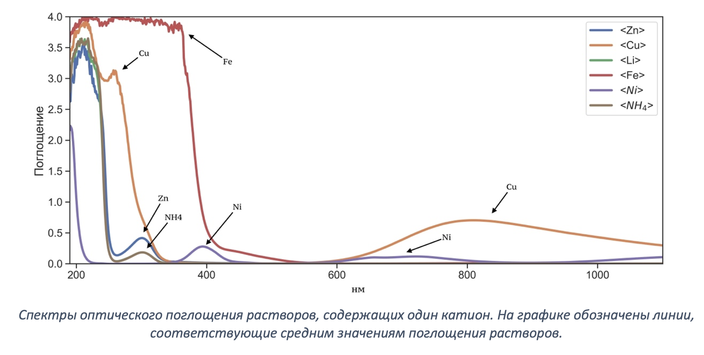
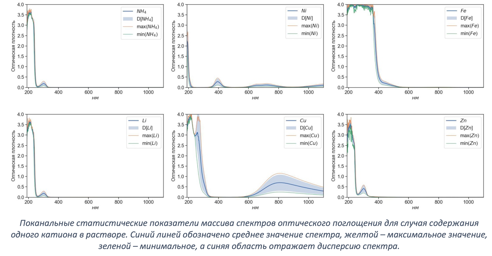
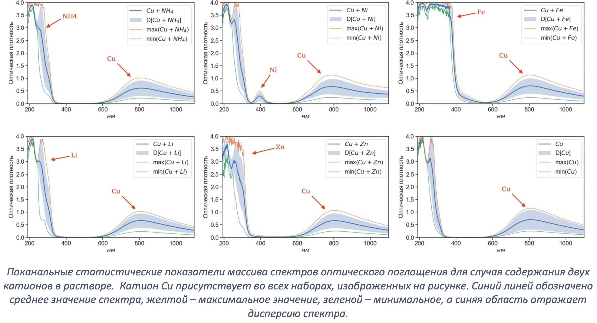
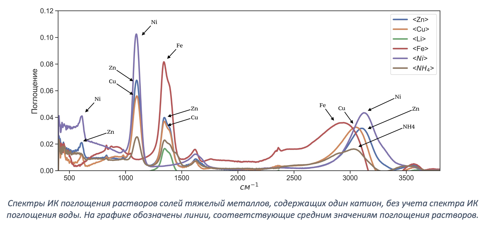
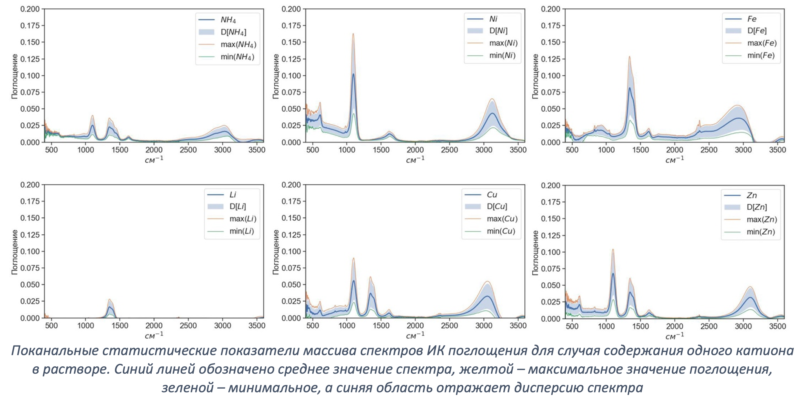

# Спектры солей тяжелый металлов

Данный репозиторий содержит базу данных с ИК спектрами и спектрами оптического поглощения солей тяжелых мателлов. Исходные данные можно найти на [сервере](http://213.131.1.132:25621/owncloud/index.php/apps/files/?dir=/HM_Salts_water_2022&fileid=281971). 
В качестве образцов реальной речной воды выступали образцы из московских рек Яузы, Битцы, Сетуни («серебряные» серии по 200 образцов) и реки Москва («золотая» серия из 400 образцов, проба отобрана в районе Островной улицы на западе Москвы). 

# 0. О базе данных.
В июле-августе 2022 года была получена база данных спектров ИК-поглощения (ИК), оптического поглощения (ОП) и комбинационного рассеяния (КР) света растворами неорганических солей $Zn(NO_3)_2$, $ZnSO_4$, $Cu(NO_3)_2$, $СuSO_4$, $LiNO_3$, $Fe(NO_3)_3$, $NiSO_4$, $Ni(NO_3)_2$, $(NH_4)_2SO_4$, $NH_4(NO_3)$ в различных водах. Дополнительно измерялся pH растворов.

Полученные спектры можно разделить на следующие серии:
- Базовая серия (Содержит 3744 уникальных примера с ненулевой концентрацией солей в дистиллированной воде)
- Золотая серия (Содержит 400 образцов, проба отобрана в районе Островной улицы на западе Москвы)
- Серебряная серия (3 серии по 200 образцов из московских рек Яузы, Битцы, Сетуни)

# 1. Базовая серия.

## 1.1. Описание файлов концентраций (правильные ответы). 
В репозитории 2 файла концентраций. 
 1. В файле [salts_water_basic_output_s.csv](./data/raw/salts_water_basic_output_s.csv) записаны концентрации солей, единицы измерения концентраций - М.
 Первый столбец - номер примера, следующие столбцы - концентрации солей (10 столбцов).
 
 2. В файле [salts_water_basic_output_i.csv](./data/raw/salts_water_basic_output_i.csv) записаны пересчитанные концентрации ионов солей, единицы измерения концентраций - М. Первый столбец - номер примера, следующие столбцы - концентрации ионов (8 столбцов): 6 ионов тяжелый металов ( $Zn$, $Cu$, $Li$, $Fe$, $Ni$, $NH_4$) и 2 аниона ( $SO_4$, $NO_3$). 

### ВНИМАНИЕ!!! 
Пример с номером '0' соответствует дистилляту.

- Данный пример отсутствует в случае спектроскопии оптического поглощения, поскольку спектр ОП раствора записывается относительно дистиллята.
- В случае ИК данному номеру соответсвуют [16 спектров дистилированный воды](./data/raw/salts_water_basic_IR_baseline.csv).

### Принципы формирования файлов с концентрациями

Изначально формировалась сетка с концентрациями ионов, причем условия ее формирования, сформулированные далее, применялись к катионам. Расчет концентраций анионов носил вторичный характер.

- Концентрация каждого катона изменяется в диапазон от 0 М до 1 М.
- Суммарная концентрация катионов в растворе не должна превышать 2 М - иначе содержимое раствора выпадет в осадок. (См. таблицу растворимости)
- Однокомпонентне растворы (содержащие 1 катион) по возможности должны формироваться с использованием как нитрата, так и сульфата, дабы провести "отвязку" катионов от анионов. Концентрация сульфатов и нитратов при этом была одинаковая. Это условие было выполнено для ионов (Zn, Cu, Ni, NH_4).
- Двухкомпонентные растворы (содержащие 2 катиона)
- Трехкомпонентные растворы (содержащие 3 катиона)

## 1.2. Оптическое поглощение (ОП) [salts_water_basic_OA.csv](./data/raw/salts_water_basic_OA.csv)
База содержит - `3744` примера спектров. Колличество признаков - `910`. Данные измерялись в деопазоне 190 - 1100 нм с шагом 1 нм. Растворы солей в речных водах измерялись относительно дистиллята. Нулевая строка соответствует первой строке в файлах концентраций (т.е. не нулевой концентрации)

В базе присутствует по 4 примера спектра однокомпонентных растворов. На графике обозначены линии, соответствующие средним значениям поглощения растворов. 

Можно заметить, что медь обладает большим поглощением в диопазоне от 600 до 1000 нм, в отличии от остальных ионов. Так-же можно заметить, что поканальная дисперсия спектра этого катиона самая большая. Раствор с катионом железа имеет зону высоко поглощения в диопазоне от 200 до 400 нм. 
Характерные пики можно наблюдать для катионов никеля (~ 400 нм) и меди (~ 800 нм). Растворы с катионами цинка и амония имеют локальный максимум при ~ 350 нм.

Более детальный аназил спектор можно провести на рисунке ниже. На рисунке показаны поканальные статистические показатели массива спектров для случая содержания одного катиона в растворе. Синий линей обозначено среднее значение спектра, желтой – максимальное значение поглощения, зеленой – минимальное, а синяя область отражает дисперсию спектра

График ниже показывает поканальные статистические показатели массива спектров оптического поглощения для случая содержания двух катионов в растворе.  Катион Cu присутствует во всех наборах, изображенных на рисунке. Синий линей обозначено среднее значение спектра, желтой – максимальное значение, зеленой – минимальное, а синяя область отражает дисперсию спектра. 

Катион меди был выбран не случайно. Он имеет характерную линию поглощения в правой части спектра, которая сильно отличает его от других катионов. На графике видно каким образом пики, обусловенные налчием тех или иных катионов, складываються в общие пики спектра. Помимо катиона меди, катион лития имеет тоже характерный пик в области ~250нм

#### Замеченные ошибки:

- в точке переключения лампы (340 нм) может возникать небольшой выброс (можно его убрать, а можно оставить, как есть, он вряд ли на что-то повлияет)
- серебряная серия 1 (Яуза) – образец №1024, возможно, испорчен – есть пометка «больше 2 мл»
- серебряная серия 2 (Битца) – один пропущен (№ 3730)
- серебряная серия 3 (Сетунь) – речная вода есть в виде двух спектров, один из них после холодильника (можно оставить один)
- серебряная серия 3 (Сетунь) – образцы № 2517, 2518 записаны по два раза (они очень похожие, но один из них идет с пометкой «true») – можно оставить по одному

## 1.3. Описание данных ИК  [salts_water_basic_IR.csv](./data/raw/salts_water_basic_IR.csv)
База содержит - `3744` примера спектров. Колличество признаков - `2126`. Нулевая строка соответствует первой строке в файлах концентраций (т.е. не нулевой концентрации)

В базе присутствует по 4 примера спектра однокомпонентных растворов. На графике ниже построены спектры, соответсвующие этим однокомпонентным растворам ионов, причем жирние линии - это поканальное среднее значение поглощения, полупрозрачные области - поканальная дисперсия. 

В таком представлении спектры визуаьно слабо различинмы. Ниже приведены те же самы спектры, только за вычетом поглощения воды. 

Тут отчетливо видно 4 характерные области пиков: ~ $1200 см^{-1}$, ~ $1400 см^{-1}$, ~ $1650 см^{-1}$ и ~ $3500 см^{-1}$. Раствор с ионом цинка имеет самый сильный пик в первой и четвертой областях, во второй и третей областях самым высоким поглощением обладает раствор с ионами железа. Раствор с ионами железа имеет характерную линию поглощения в диопазоне от ~ $1700 см^{-1}$ до ~ $3000 см^{-1}$

Ниже приведены те же самые спектры, только со статистическими показателями - дисперсией, средними, минимальным и максимальным значениями. Синий линей обозначено среднее значение спектра, желтой – максимальное значение поглощения, зеленой – минимальное, а синяя область отражает дисперсию спектра.

Так-же как и для спектор ОП, для спекторв ИК был построен график поканальных статистических показателей массивов спектра ИК поглощения для случая содержания двух катионов в растворе.  Катион Zn присутствует во всех наборах, изображенных на рисунке. Синий линей обозначено среднее значение спектра, желтой – максимальное значение поглощения, зеленой – минимальное, а синяя область отражает дисперсию спектра. 

