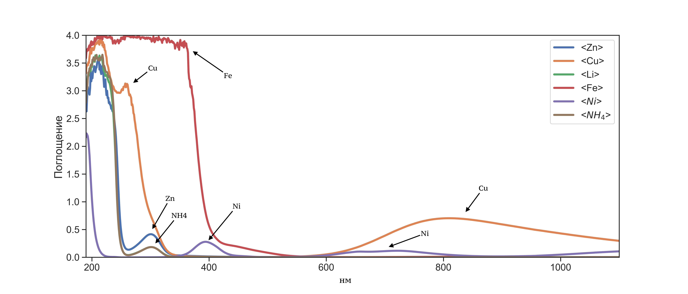
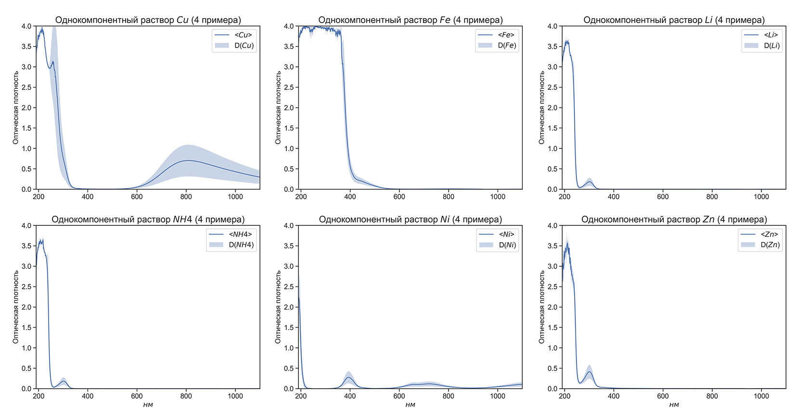
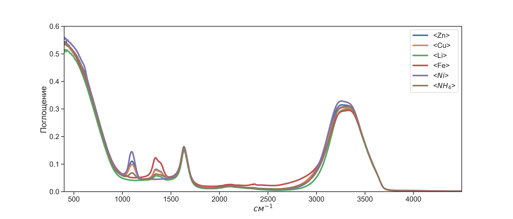
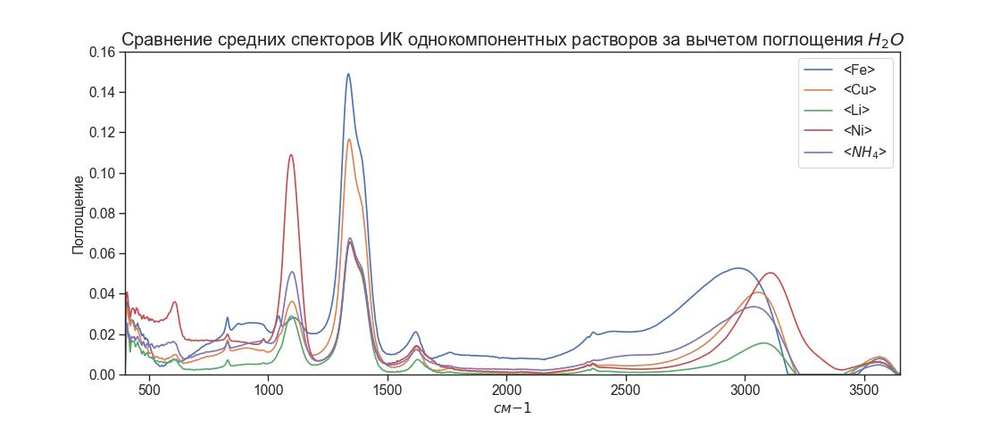
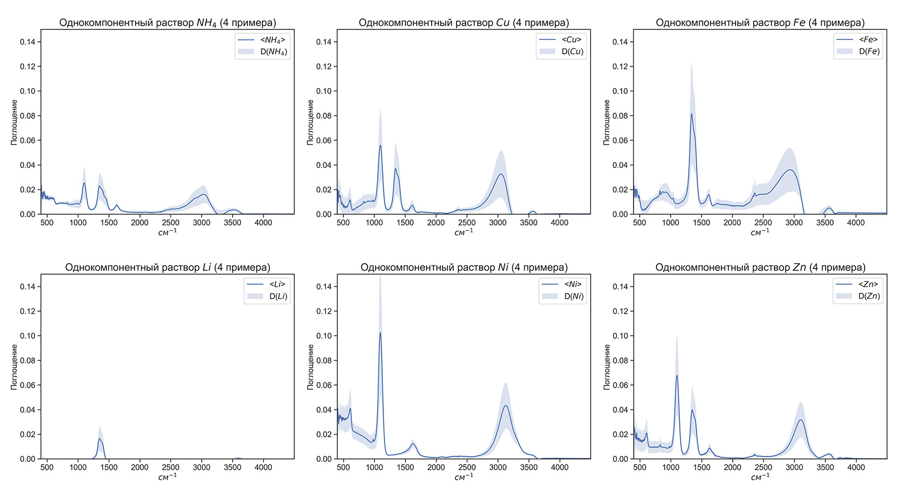

# Спектры солей тяжелый металлов

Данный репозиторий содержит базу данных с ИК спектрами и спектрами оптического поглощения солей тяжелых мателлов. Исходные данные можно найти на [сервере](http://213.131.1.132:25621/owncloud/index.php/apps/files/?dir=/HM_Salts_water_2022&fileid=281971). 
В качестве образцов реальной речной воды выступали образцы из московских рек Яузы, Битцы, Сетуни («серебряные» серии по 200 образцов) и реки Москва («золотая» серия из 400 образцов, проба отобрана в районе Островной улицы на западе Москвы). 

## 1. Описание файлов концентраций (выходы). 
В репозитории 2 файла концентраций. 
 1. В файле [salts_water_basic_output_s.csv](./data/raw/salts_water_basic_output_s.csv) находятся концентрации солей. Всего было 10 различных видов солей: $Zn(NO_3)_2$, $ZnSO_4$, $Cu(NO_3)_2$, $CuSO_4$, $LiNO_3$, $Fe(NO_3)_3$, $NiSO_4$, $Ni(NO_3)_2$, $(NH_4)_2SO_4$, $NH_4(NO_3)_2$,
 2. В файле [salts_water_basic_output_i.csv](./data/raw/salts_water_basic_output_i.csv) пересчитанные концентрации уже для ионов металлов. Десять солей были образованы за счет 6 ионов тяжелый металов ( $Zn$, $Cu$, $Li$, $Fe$, $Ni$, $NH_4$) и двух анионов ( $SO_4$, $NO_3$)

Первая строка в обоих файлах соответсвует нулевой концентрацией солей. В случае ИК данная строка соответсвует [16 спектрам дистилированный воды](./data/raw/salts_water_basic_IR_baseline.csv), а в случае оптического поглощения данную строку можно не рассматривать.
Помимо первой строки нулевой концентрации, каждая новая строка файла соответсвует новому примеру в файлах [ИК](./data/raw/salts_water_basic_IR.csv) и [Оптического поглощения](./data/raw/salts_water_basic_OA.csv) 

## 2. Описание данных оптического поглощения [salts_water_basic_OA.csv](./data/raw/salts_water_basic_OA.csv)
База содержит - `3744` примера спектров. Колличество признаков - `910`. Данные измерялись в деопазоне 190 - 1100 нм с шагом 1 нм. Растворы солей в речных водах измерялись относительно дистиллята. Нулевая строка соответствует первой строке в файлах концентраций (т.е. не нулевой концентрации)

В базе присутствует по 4 примера спектра однокомпонентных растворов. На графике ниже построены спектры, соответсвующие этим однокомпонентным растворам ионов, причем жирние линии - это поканальное среднее значение поглощения, полупрозрачные области - поканальная дисперсия. 

Можно заметить, что медь обладает большим поглащением в диопазоне от 600 до 1000 нм, в отличии от остальных ионов. Так-же можно заметить, что поканальная дисперсия спектра этого иона самая большая. Раствор с ионом железа имеет зону высоко поглощения в диопазоне от 200 до 400 нм. 
Характерные пики можно наблюдать для ионов никеля (~ 400 нм) и меди (~ 800 нм). Растворы с ионами цинка и амония имеют локальный при ~ 350 нм.

#### Замеченные ошибки:

- в точке переключения лампы (340 нм) может возникать небольшой выброс (можно его убрать, а можно оставить, как есть, он вряд ли на что-то повлияет)
- серебряная серия 1 (Яуза) – образец №1024, возможно, испорчен – есть пометка «больше 2 мл»
- серебряная серия 2 (Битца) – один пропущен (№ 3730)
- серебряная серия 3 (Сетунь) – речная вода есть в виде двух спектров, один из них после холодильника (можно оставить один)
- серебряная серия 3 (Сетунь) – образцы № 2517, 2518 записаны по два раза (они очень похожие, но один из них идет с пометкой «true») – можно оставить по одному

## 3. Описание данных ИК  [salts_water_basic_IR.csv](./data/raw/salts_water_basic_IR.csv)
База содержит - `3744` примера спектров. Колличество признаков - `2126`. Нулевая строка соответствует первой строке в файлах концентраций (т.е. не нулевой концентрации)

В базе присутствует по 4 примера спектра однокомпонентных растворов. На графике ниже построены спектры, соответсвующие этим однокомпонентным растворам ионов, причем жирние линии - это поканальное среднее значение поглощения, полупрозрачные области - поканальная дисперсия. 

В таком представлении спектры визуаьно слабо различинмы. Ниже приведены те же самы спектры, только за вычетом поглощения воды 

Тут отчетливо видно 4 характерные области пиков: ~ $1200 см^{-1}$, ~ $1400 см^{-1}$, ~ $1650 см^{-1}$ и ~ $3500 см^{-1}$. Раствор с ионом цинка имеет самый сильный пик в первой и четвертой областях, во второй и третей областях самым высоким поглощением обладает раствор с ионами железа. Раствор с ионами железа имеет характерную линию поглащения в диопазоне от ~ $1700 см^{-1}$ до ~ $3000 см^{-1}$

